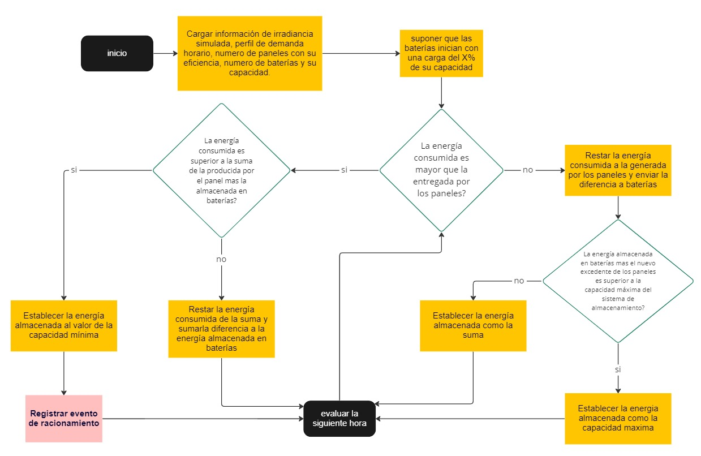
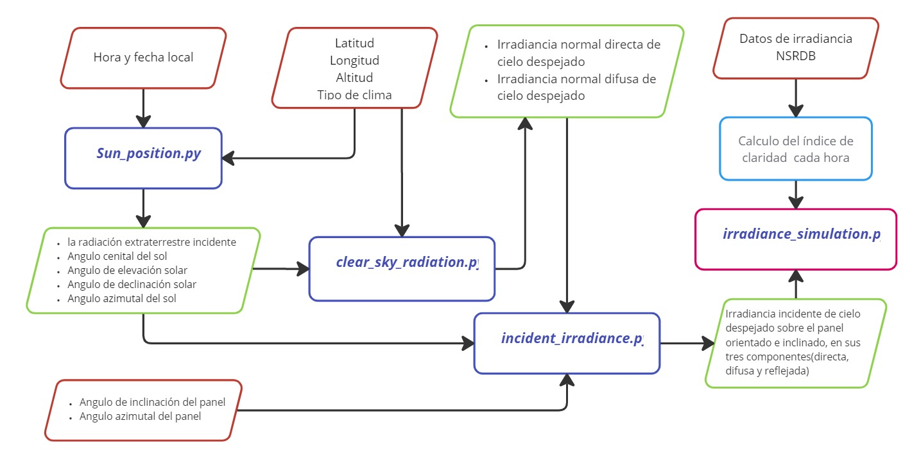

# Isolated-PV-system

Conjunto de módulos en Python para dimensionar un sistema fotovoltaico fijo, sin acceso a la red eléctrica pública, mediante un modelo simplificado.

Esta primera versión esta orientada al calculo del racionamiento máximo anual (porcentaje de días al año en el que el sistema fotovoltaico deja de entregar potencia dado que no puede suplir la energía demandada durante una o varias horas), utilizando el método de monteCarlo.

Para ello es necesario contar con la siguiente información:

1.  Hora y fecha local
2.  Datos geográficos:
    -  Latitud [° Decimales (DD)]
    -  Longitud [° Decimales (DD)]
    -  Altitud [m]
    -  Tipo de clima ['Tropical', 'Midlatitude summer', 'Subarctic summer', 'Midlatitude winter']
3.  disposición del arreglo de módulos solares fijos 
    -   Angulo de inclinación del panel [°]
    -   Angulo azimutal del panel [°]
4.  Datos de irradiancia horaria en un año, preferiblemente de la [NSRDB](https://nsrdb.nrel.gov/), en una hoja de cálculo con los siguientes títulos y datos
    -   Month
    -   Day
    -   Hour
    -   Minute
    -   Clearsky GHI
    -   GHI
5.  Perfil diario de demanda de energía en intervalos de una hora, en una hoja de cálculo

## Lista de funciones

-  **sun_position**: retorna en coordenadas celestes la posición del sol, dada una ubicación, fecha y hora local.

-  **transmittance_br_constants**: retorna los índices para el cálculo de transmitancias de radiación directa y difusa a través de atmósferas claras.

-  **clear_sky_radiation**: retorna la irradiancia normal de cielo despejado en sus componentes directa y difusa. El cálculo está basado en el método propuesto por Hotel (1976)

-  **incident_irradiance**: calcula la irradiancia incidente sobre una superficie arbitrariamente orientada e inclinada, en sus tres componentes(directa, difusa y reflejada), asumiendo un cielo despejado.

-  **irradiance_simulation**: retorna la irradiancia horaria incidente considerando las pérdidas por nubosidad, asignando valores aleatorios con una distribución normal, en función de los valores ingresados del valor medio y desviación estándar del índice de claridad para el periodo a simular, partiendo de los valores de irradiancia incidente sobre una superficie arbitrariamente orientada e inclinada con el cielo despejado.

-  **rationing**: Calcula el porcentaje de días de racionamiento con la irradiancia simulada incidente en el panel correspondiente a los datos de irradiancia y energía consumida por hora, y energía disponible en el sistema de almacenamiento, dada una configuración de cantidad de baterías y módulos solares.

-  **rationing_monteCarlo**: calcula n veces el racionamiento anual dadas n condiciones de irradiancia (simulaciones anuales), el perfil de demanda horaria, cantidad y características de paneles y baterías.

En el archivo [explanatory_notes.ipynb](./explanatory_notes.ipynb) se expone de manera breve el resultado y utilidad de cada una de las anteriores funciones.

## Metodología

La función esencial es [rationing](./functions/rationing.py), la cual se encarga de efectuar una simulación anual de balance energético hora a hora, comparando la energía consumida en la ultima hora, la energía generada por el arreglo de módulos (paneles) solares y la energía almacenada en el grupo de baterías. El siguiente diagrama de flujo explica el funcionamiento del algoritmo utilizado:




La función principal [rationing_monteCarlo](./functions/rationing.py) integra todos los datos requeridos para efectuar **n** simulaciones de irradiancia anuales, con las cuales se realizan las **n** simulaciones de racionamiento.

La simulación de irradiancia utiliza las demás funciones  y su integración se describe en el siguiente diagrama:



## Implementación 

Una simulación con el método monteCarlo, para obtener datos de racionamiento anual en tantas iteraciones como se quiera, se puede realizar como se indica en el siguiente bloque de código:

```python
import pandas as pd
from numpy import mean, std
import datetime
from matplotlib.pyplot import *

from functions.rationing import rationing_monteCarlo
# Adecuando los datos de entrada:

## importando datos de irradiancia
df_irradiancia = pd.read_excel('data.xlsx', sheet_name='NSRDB', usecols=['Month','Day','Hour','Minute','Clearsky GHI','GHI'] )
## reemplanzando headers con espacios por barras
df_irradiancia.columns = [c.replace(' ', '_') for c in df_irradiancia.columns]
df_irradiancia['K_t'] = ( df_irradiancia['GHI'] / df_irradiancia['Clearsky_GHI'] )

## importando datos del perfil de consumo horario en un dia
consumo_horario = pd.read_excel('data.xlsx', sheet_name='Edt',index_col='hora')
## generando una lista con los valores de energía en intervalos de una hora
energia_hora = [ i.energia for i in consumo_horario.itertuples() ]

# Cantidad de módulos y baterías
n_modulos = 8
n_baterias = 4

# Precio de cada módulo
p_modulo = 798011.78
# Precio de cada batería
p_bateria = 1787409

# Función simplificada de costos
costo = n_modulos * p_modulo + n_baterias * p_bateria

r_mc = rationing_monteCarlo(    iterations=100,                     # numero de iteraciones [und]
                                irradiance_data=df_irradiancia,     # datos de irradiancia [DataFrame de Pandas]
                                time_zone=-5,                       # horas [H-GMT]
                                latitude=4.591480,                  # latitud [° Decimales (DD)]
                                longitude=-74.691412,               # longitud [° Decimales (DD)]
                                altitude=321,                       # altitud [m]
                                climate_type='Tropical',            # tipo de clima ['Tropical', 'Midlatitude summer', 'Subarctic summer', 'Midlatitude winter']
                                year=2022,                          # año[AAAA]
                                surf_azm=180,                       # angulo azimutal del arreglo de módulos [°]
                                surf_tilt=4,                        # angulo de inclinación del arreglo de módulos [°]
                                albedo=0.17,                        # albedo [adimensional]
                                energy_per_hour=energia_hora,       # datos horarios del consumo energético cada hora en un dia normal [Wh]
                                n_m=n_modulos,                      # numero de módulos en el arreglo [und]
                                A_m=2.5,                            # area efectiva del modulo [m^2]
                                eta_m=19,                           # eficiencia del modulo [%]
                                n_b=n_baterias,                     # numero de baterías [und]
                                v_b=12,                             # tension nominal de la batería [Vdc]
                                E_b_max=300,                        # capacidad de la batería [Ah]
                                l_b_min=40,                         # nivel mas bajo de descarga de la batería [%] (100% - profundidad de descarga)
                                l_b_0=50                            # nivel de carga inicial del sistema de almacenamiento [%]
                            )

print('costo: $', costo )
print('máximo racionamiento:', round( max(r_mc) * 100 , 2 ), '%' )
print('media:',round(  mean(r_mc) * 100, 2 ), '%' )
print('desviación estándar:', round( std(r_mc) * 100, 2 ), '%' )
```

También se puede verificar el resultado en Jupyter Notebook de ejemplo: [optimization_example.ipynb](./optimization_example.ipynb).

